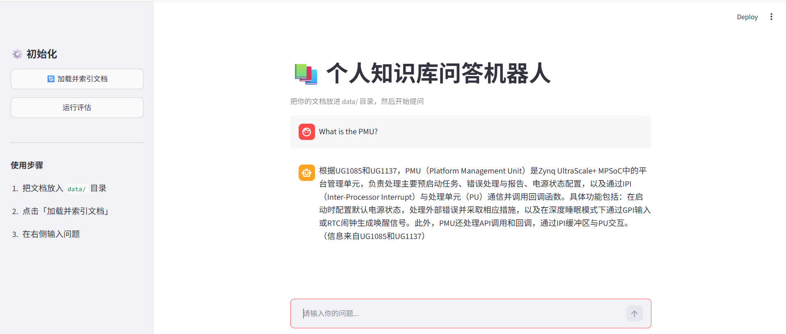

**English** | [中文](README_CN.md)

# 🔍 Project 4: AMD Technical Document Multi-Document Q&A System

A production-oriented multi-document RAG system for AMD FPGA/SoC technical documentation. The system combines hybrid BM25 + vector retrieval, multilingual Query Translation, source attribution, Redis caching, and a FastAPI backend, and is containerized with Docker for deployment.

🚀 **Live Demo:** [AMD Doc Agent]https://huggingface.co/spaces/chongyuanz/amd-doc-agent



## Engineering Highlights

- **Hybrid Retrieval:** Combined FAISS semantic search with BM25 keyword retrieval for technical terminology.
- **Multilingual Retrieval:** Added LLM-based Query Translation to improve cross-language retrieval across Chinese and English documentation.
- **Evaluation:** Used RAGAS to compare retrieval strategies and quantify Faithfulness and Context Precision.
- **Performance:** Added Redis caching, reducing repeated-query latency from ~13s to ~0.005s.
- **Productionization:** Exposed the RAG pipeline through FastAPI and containerized the application with Docker Compose.
- **Source Attribution:** Preserved document metadata throughout retrieval and generation to make answers traceable.

## Architecture and Deployment Overview
                    ┌─────────────────┐
                    │   Streamlit UI  │
                    └────────┬────────┘
                             │
                             ▼
                    ┌─────────────────┐
                    │    FastAPI      │
                    │     /ask        │
                    └────────┬────────┘
                             │
                       ┌─────▼─────┐
                       │   Redis   │
                       │   Cache   │
                       └─────┬─────┘
                             │ miss
                             ▼
                    ┌─────────────────┐
                    │ Query Processing│
                    │ Translation     │
                    └────────┬────────┘
                             │
                ┌────────────┴────────────┐
                ▼                         ▼
          ┌───────────┐             ┌───────────┐
          │   FAISS   │             │   BM25    │
          │ Semantic  │             │ Keyword   │
          └─────┬─────┘             └─────┬─────┘
                └────────────┬────────────┘
                             ▼
                    ┌─────────────────┐
                    │  LLM Generation │
                    │ + Source Attribution
                    └─────────────────┘

Docker Compose
├── Streamlit :8501
├── FastAPI   :8000
└── Redis     :6379

## Knowledge Base

| Document | Content | Language |
|---|---|---|
| UG1283 | Bootgen User Guide | Chinese |
| UG1085 | Zynq UltraScale+ Technical Reference Manual | English |
| UG1137 | Zynq UltraScale+ MPSoC Software Developer Guide | English |

Together, the three documents cover the end-to-end workflow from **hardware
architecture → software development → boot image generation**, enabling
cross-document technical queries.

## Demo

> **Q:** What is the role of FSBL?
>
> **A:** According to UG1085, the FSBL begins execution after the CSU ROM
> enters the post-configuration phase and is responsible for system
> tamper-response handling. According to UG1137, the FSBL copies bitstream
> blocks directly from the flash device and performs authentication.
> According to UG1283, FSBL participates in multiple security-related stages
> of the boot process, including encryption and signing.
>
> *(Information retrieved from UG1085, UG1137, and UG1283.)*

## Core Features

### Multi-Document Retrieval

Three technical documents are embedded into a shared FAISS vector store. Each
chunk is tagged with source metadata such as `source` and `filename`, allowing
the retriever to search across documents and preserve document provenance.

### Multilingual Retrieval with Query Translation

A mixed Chinese-English knowledge base introduces a retrieval bias: Chinese
queries tend to have higher embedding similarity with Chinese chunks, causing
English documents to be systematically under-retrieved.

To address this, the system uses **Query Translation** before retrieval:

1. Generate an English translation of the user's query using an LLM.
2. Search using both the original Chinese query and the translated English query.
3. Merge and deduplicate the results.
4. Select the final top-k chunks.

This improves retrieval of relevant English documentation for
Chinese queries.

### Source Attribution

Each chunk stores source information in `metadata["source"]`. Retrieved
metadata is passed through the RAG pipeline and used to associate generated
answers with the source documents used for retrieval.

### FastAPI Backend

In addition to the Streamlit UI, the system provides a RESTful API for
integration with other applications.

The API response includes:

- `answer`
- `question`
- `sources`

Middleware also records the response time for each request.

### Redis Caching

Repeated queries are served directly from Redis instead of running through
the complete RAG pipeline again.

| Configuration | Response Time |
|---|---:|
| Full RAG pipeline | ~13 seconds |
| Redis cache hit | ~0.005 seconds |

Cache keys are normalized by converting text to lowercase and removing
whitespace, reducing unnecessary cache misses caused by minor differences in
query formatting.

### RAGAS Evaluation

An offline RAGAS evaluation pipeline was implemented to compare retrieval
strategies using Faithfulness, Answer Relevancy, and Context Precision.

The current evaluation results demonstrate the impact of hybrid retrieval,
while Answer Relevancy remains subject to evaluator/API compatibility
constraints with the current DeepSeek configuration.

| Retrieval | Faithfulness | Answer Relevancy | Context Precision |
|---|---:|---:|---:|
| Vector + Query Translation | 0.39 | 0.54 | 0.06 |
| Vector + BM25 + Query Translation | 0.80 | 0.50 | 0.16 |

Adding BM25 hybrid retrieval on top of Query Translation improved
**Faithfulness by 105%** and **Context Precision by 171%** in the evaluation
set, while Answer Relevancy remained roughly unchanged.

The remaining low scores primarily originate from the retrieval layer:
residual PDF noise remains after preprocessing, and semantic mismatch still
exists between Chinese queries and English technical documentation. These
remain key areas for further optimization.

### Cloud Deployment

The application is containerized with Docker and deployed to
**Hugging Face Spaces** on the CPU Free tier, making the system publicly
accessible.

## Tech Stack

- **LangChain** — RAG framework for document loading, chunking, and retrieval
- **Hugging Face / Sentence Transformers** — `all-MiniLM-L6-v2` embeddings
- **DeepSeek** — LLM generation
- **FAISS** — semantic vector store
- **BM25** — keyword retrieval
- **RAGAS** — RAG evaluation framework
- **FastAPI** — RESTful API backend
- **Redis** — Response caching
- **Streamlit** — Web UI
- **Docker** — Containerization
- **Hugging Face Spaces** — Cloud hosting

## Quick Start

### API Example

```bash
curl -X POST "http://localhost:8000/ask" \
  -H "Content-Type: application/json" \
  -d '{"question":"What is Bootgen?"}'
```

Example Response:
```json
{
  "answer": "...",
  "question": "What is Bootgen?",
  "sources": ["UG1085", "UG1137"]
}  
```

### Run the Complete Application with Docker Compose
```bash
docker compose up --build
```
Streamlit: http://localhost:8501
FastAPI:   http://localhost:8000/docs

### Local Development
The Streamlit and FastAPI applications can also be run individually.
Redis must be running locally for the FastAPI cache to work.

```bash
docker run -d -p 6379:6379 redis
```

### Local Streamlit Application

```bash
pip install -r requirements.txt
cp .env.example .env
```
Set `DEEPSEEK_API_KEY` in `.env`. Do not commit `.env` to the repository.

```bash
streamlit run app.py
```

### Local FastAPI Server
```bash
uvicorn main:app --reload
```
Open http://localhost:8000/docs to access the interactive API documentation.

## Project Structure

```
├── data/                  # Three AMD technical documentation PDFs
├── images/
├── src/
│   ├── loader.py          # Multi-document loading, noise cleaning, and source metadata
│   ├── embedder.py        # Embedding generation and FAISS storage
│   ├── retriever.py       # Similarity search + multilingual retrieval
│   │                       # (Query Translation)
│   ├── chain.py            # RAG chain and source attribution prompt
│   ├── evaluator.py       # Keyword-based evaluation (baseline)
│   └── evaluator_ragas.py # RAGAS evaluation (advanced)
├── main.py                # FastAPI entry point (REST API + Redis cache)
├── cache.py               # Redis caching logic
├── app.py                 # Streamlit entry point
├── Dockerfile
├── Dockerfile.api
├── docker-compose.yml
├── requirements.txt
├── requirements-eval.txt
├── README_CN.md
├── .env.example
├── .dockerignore
└── README.md
```

## Project Evolution

Project 1 → Basic RAG
      ↓
Project 2 → AMD Bootgen RAG
      ↓
Project 3 → Bootgen Agent / LangGraph / MCP
      ↓
Project 4 → Multi-document RAG / Hybrid Retrieval /
            Evaluation / API / Deployment

> **Project Series:** [Projects 1–2: RAG Knowledge Base](../rag-knowledge-bot) → [Project 3: Bootgen Agent](../bootgen-agent) → **Project 4: Multi-Document RAG + Deployment (Current)**

## Known Limitations

- Parsing quality for tables and multi-column layouts remains limited.
- Query Translation introduces an additional LLM call and latency.
- Answer Relevancy evaluation has compatibility constraints with the current
  DeepSeek configuration.

## Future Improvements

- Expand the knowledge base with additional AMD documentation.
- Add a reranking stage to improve retrieval precision.
- Evaluate managed vector databases as the corpus grows.